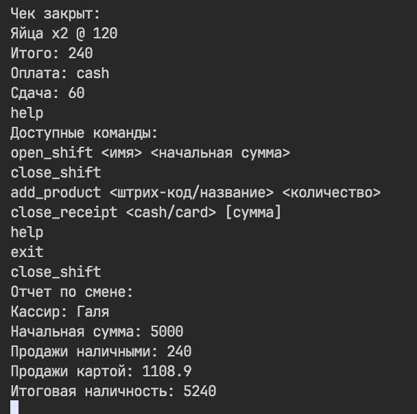

# rmk

Консольное приложение. Поддерживает открытие/закрытие смен, добавление товаров в чек, закрытие чека с оплатой (наличными или картой), и учёт смен и продаж. 

## 📦 Использование

**Установка**

```bash
git clone https://github.com/inautum/rmk.git
cd rmk
```

**Запуск**

```bash
make
./rmk
```

**Функции**

- `open_shift <имя> <начальная сумма>` – открытие кассы
- `close_shift` – закрытие кассы, будет выведена информация о смене
- `add_product <штрих-код/название> <количество>` – добавление товара в чек
- `close_receipt <cash/card> <сумма>` – закрытие (оплата) чека, если оплата картой, то `сумма` не нужно указывать, так как не нужно выдавать сдачу
- `help` – вывод доступных команд
- `exit` – выход из приложения

**Пример использования:**

